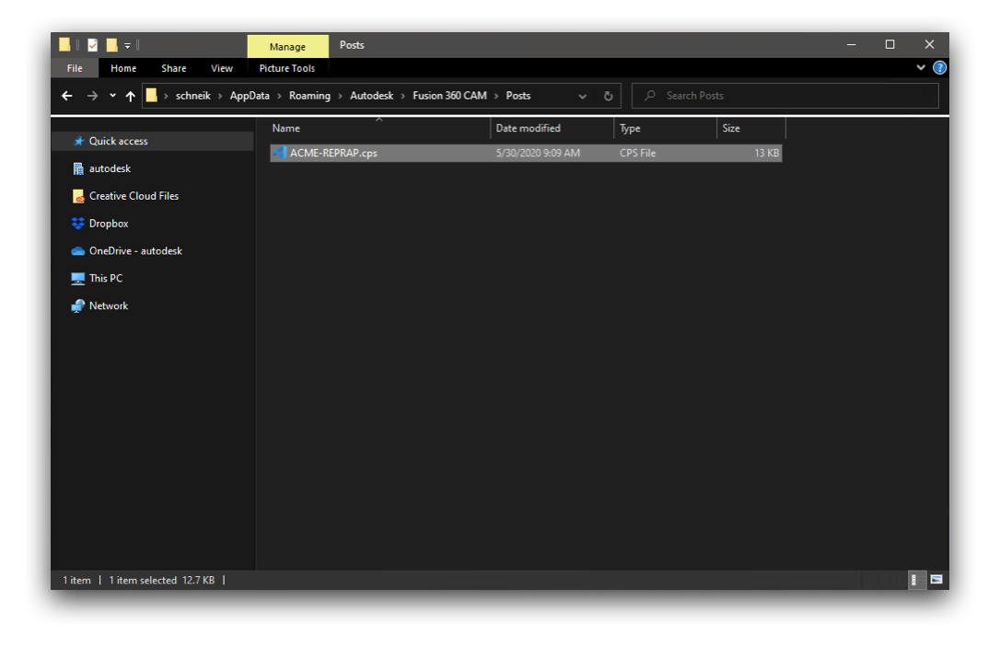
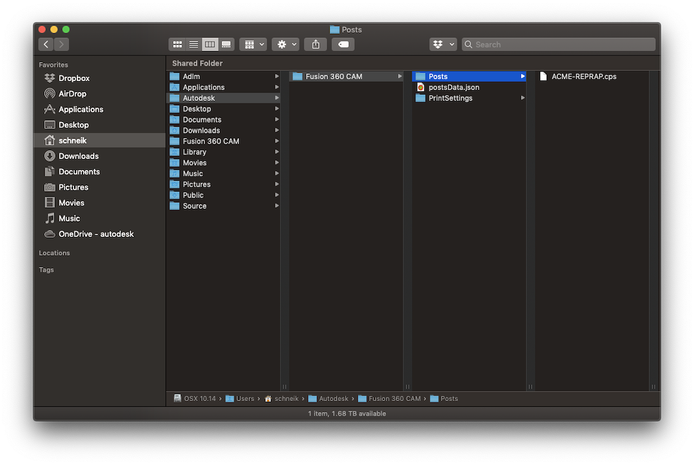

# ACME-REPRAP-F360Post

Fusion 360 Post for Duet FFF cartesian printers.

## Features

This Post is used by Fusion 360 to configure how FFF manufacturing setups are exported (posted) to gcode.
It is used to ensure the gcode complies with the Duet line of FFF mainboard's firmware gcode expectations. Posts are Java script document and can be editied using any IDE of your choice.

This post should be able to be used with any Duet3D 2 or 3 mainboard equiped printer.

Users should ensure that bed size their custom machine configuration and other options match their printer.

This post impliments two workarounds:

1.  The Fusion 360 currentl sets standby temps only on a toolchange. The standby temp is set as main temp setting for tthe non active tool. The post has a user value that can be used to set standby temps which sets the R paramater for the tool inline with Duet3D Reprap firmware specifications.
2.  The standard print setting defaults all primary extrusion to Tool 0. The post workaround allow you to select a diferent primary tool.

## Instalation

Download the cps file.
If using Fusion 360 cloud posts. Upload the cps to the post folder in your Team's asset folder. This requires Team Admin priveledges.
If using local posts, move this post to your local post directory.

On Windows this is located in C:\Users\ << Your user >> \AppData\Roaming\Autodesk\Fusion 360 CAM\Posts\  

On MAC OS this is located in ~/Autodesk/Fusion 360 CAM/Posts/  
  

